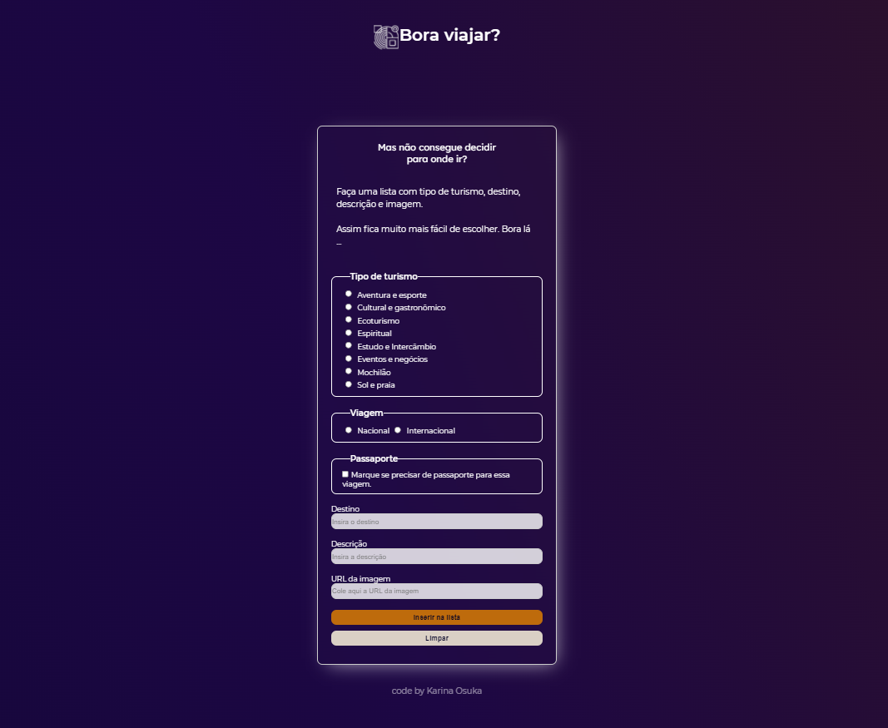

# Formulário
Curso Certified Tech Developer.

###
Projeto do primeiro checkpoint da matéria FrontEnd II, consisite em criar um formulário para que o usuário crie uma lista. 
O formulário deve ter pelo menos 4 campos: título, descrição, Url da imagem e um botão submit. 
Após o preenchimento, ao clicar no botão de submit, as informações devem ser adicionadas a um novo card na página.

### Screenshot

[GitHub pages](https://kari-osk.github.io/frontend2-checkpoint/ "Frontend")

